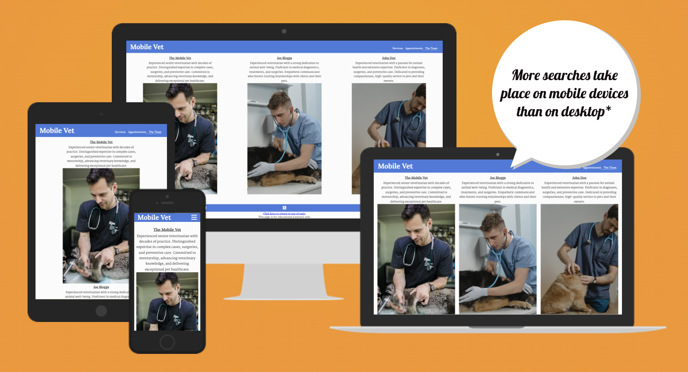
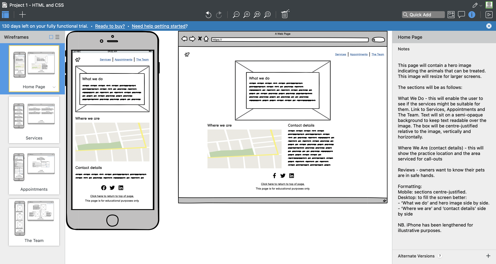
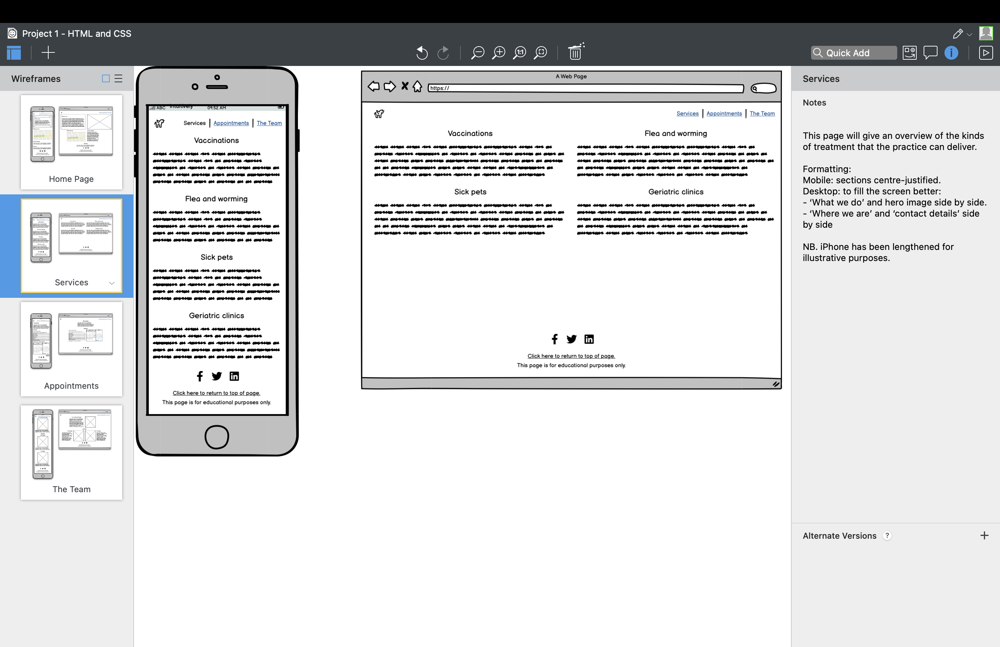
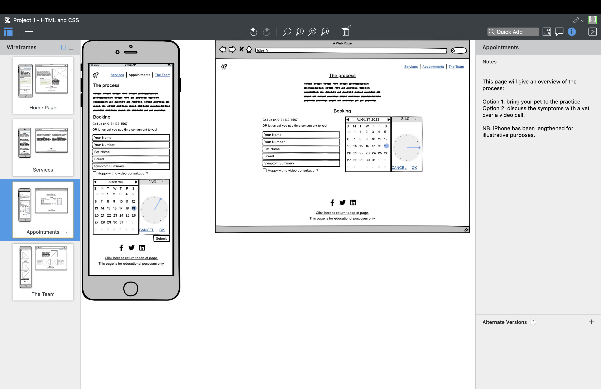
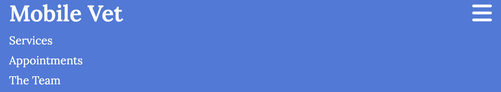
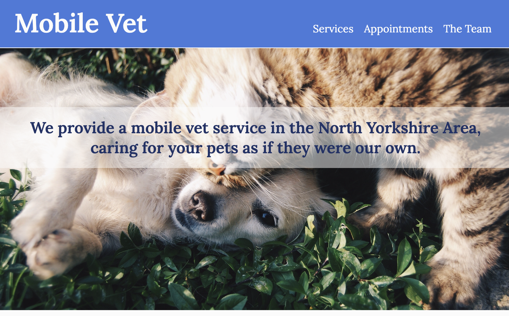
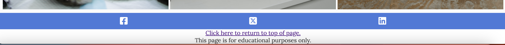
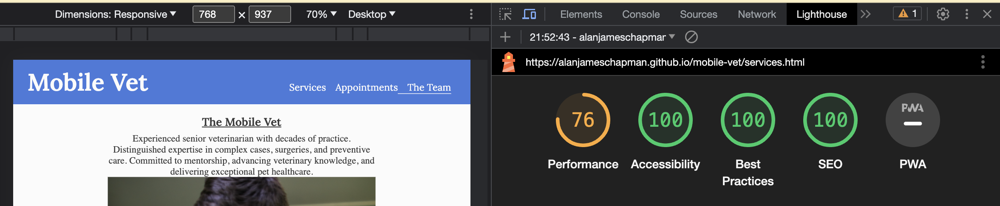

# Mobile Vet

The Mobile Vet is a Veterinary Service to treat poorly animals. There will be a main clinics (based in Thirsk), but owners can request a call-out if they are unable to get to the practice.

## Planning

The website has been designed for mobile-first, from iPhone 6 and onwards, and will be responsive for larger screen sizes. It is envisaged that the majority of users will be viewing from mobiles. Moreover, it is easier to design for small screens then enlarge for desktops vs the other way around.

For small screens the nav bar will be reduced to a burger bar to avoid screen clutter.

### Target Audiences:
- Users with pets who are poorly.
- Users who have the ability to travel to the practice for treatment.
- Users who are unable to travel to the practice for treatment.

### User Stories:
- As a user, I want to be able to get help for my pet quickly and easily.
- As a user, I want confidence that I will receive a professional service built on trust.
- As a user, I want flexibility on how I can get help for my pet.

### Site Aims:
- To connect with the user that will ultimately result in a sale.
- To enable the user to be able to navigate around the website intuitively.
- I provide a means for the user to book an appointment, or simply call. 

Note: Due to a house-move, I decided to take a leave of absence of 3 weeks. During this time, Code Institute updated the course to include a mobile-first approach to website design, and a Flexbox module also. Both were implemented in my final website.

### Pages with wireframes

**The Mobile Vet**

This page will contain a hero image indicating the animals that can be treated. This image will resize for larger screens

Text will enable the user to see if the services might be suitable for them. Text will sit on a semi-opaque background to keep text readable over the image. The box will be centre-justified relative to the image, vertically and horizontally.

- Where We Are (contact details) - this will show the practice location.

**Services**

This page will give an overview of the kinds of treatment that the practice can deliver.

**Appointments**

This page allows the user to book an appointment with a vet convenient to them.

**The Team**

Owners want to know their pets are in safe hands. This page introduces member of The Team with profiles and 'friendly faces'.

## Features

### Features common to all pages

**Navigation Bar**

The navigation bar is on all pages (for quick/easy navigation) and responds to smaller screens by reducing to a burger icon, which expands downwards to reveal all pages. Links to Mobile Vet, Services, Appointments and The Team pages. As a result, the user has no need to use their browser 'back' button.

**The hero images**

Common to all but The Team page (which already contains three profile images) each page has an image with text overlay to summarise to the user what the page is about. Each page has a different image to keep the user interested.
Text sits on a semi-opaque background to keep text readable over the image. The box will be centre-justified relative to the image, vertically and horizontally.

**The Footer**

The footer section includes links to the associated Facebook, X and linkedin pages for The Mobile Vet. There they would gather more information relevant. The links open to a new tab to avoid the user from 'losing their bearings' on the site.
There is also a hyperlink to return the user to the top of the page, particularly useful for mobile users.
"This page is for educational purposes only." is self-explanatory.

## Testing

- I deployed before content creation for feedback from Mentor and friends.
- I also posted to #peer-code-review on Slack for peer review.
- I continuously tested my website on different screen sizes using DevTools on Chrome and different devices.
- Once the website was deployed I checked using W3C validator at every push/deployment - see Validator Testing section below.

### Validator Testing

**HTML**
No errors or warnings were returned when passing through the official [W3C validator](https://validator.w3.org/nu/?doc=https%3A%2F%2Falanjameschapman.github.io%2Fmobile-vet%2Findex.html)

**CSS**
No errors were found when passing through the official [(Jigsaw) validator](http://jigsaw.w3.org/css-validator/validator$link)

**LIGHTHOUSE**
Lighthouse validation results vary accross the site (see docs) and screen sizes but in all cases checked, Accessibility is above 90%. As an example:
 

### Future Enhancements

The form on The Appointments page doesn't do anything with the data captured, as it is not part of the course content to this point.
On the index page, a Reviews section could be added to give further confidence to users on the level of service. 

## Deployment

The site was deployed to GitHub pages. The steps to deploy were as follows:
- In the GitHub repository, I navigated to the Settings tab
- From the source section drop-down menu, I selected the Master Branch
- Once the master branch was selected, the page refreshed with a ribbon showing successful deployment.
- The live link can be found here - <<https://alanjameschapman.github.io/mobile-vet/index.html>

## Credits

### Google Font Choice

I have used fonts with serif adds a desirable formal tone to the site.
For headings: Lora is a variable font, which may help to reduce font family file size. Bold 700 seems too heavy and may take up too much space on smaller screens. Moreover, the bold 700 italic may be too cramped to read easily. Therefore, semibold 600 (with italic) and regular 400 (with italic) are all chosen.

### Content

The text for the pages was created by ChatGPT
The icons in the footer were taken from [Font Awesome](https://fontawesome.com/)

### Media

The images used on all pages are from https://www.pexels.com/. The authors were Snapwire, Gustavo Fring and Tima Miroshnichenko.